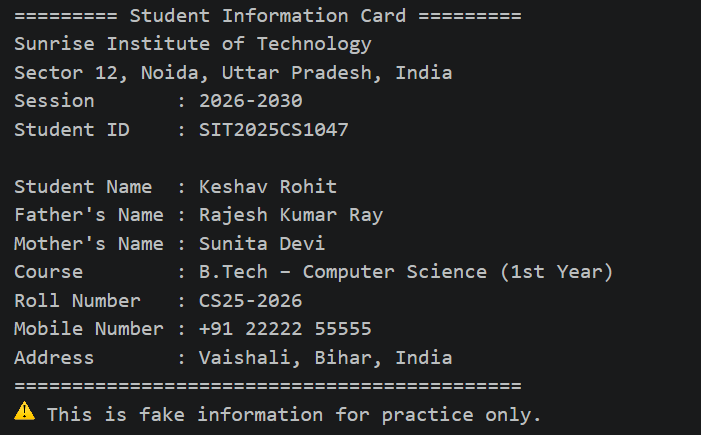

# Student Information Card

## Description

This is my second JavaScript practice project.

The purpose of this project is to practice declaring variables and displaying information using `console.log()`.

## Concepts Used

- Variables
- Strings
- Numbers
- Console Output

## Project Structure

```
02-student-information-card/
│
├── script.js
├── README.md
└── output-student-information-card.png
```

## Output



## What I Learned

- Declaring variables using `var`
- Storing different data types
- Printing formatted output using `console.log()`
- Organizing a JavaScript project with a proper folder structure

## Future Improvements

- Take user input instead of hardcoded values
- Display information on a web page using HTML and JavaScript